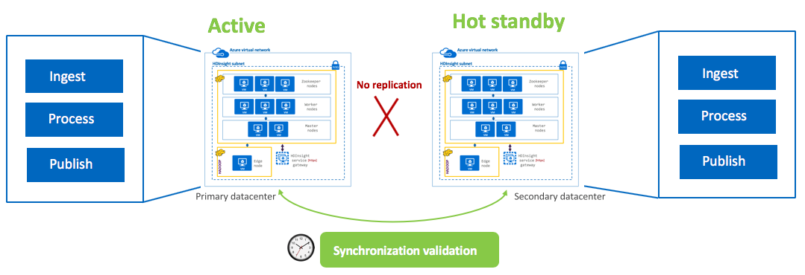
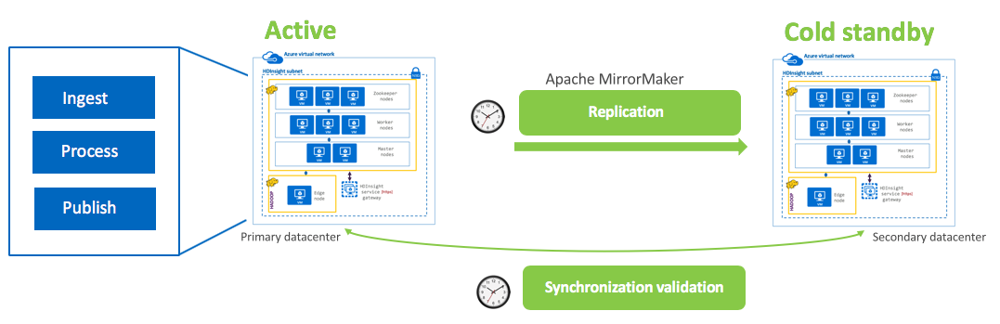
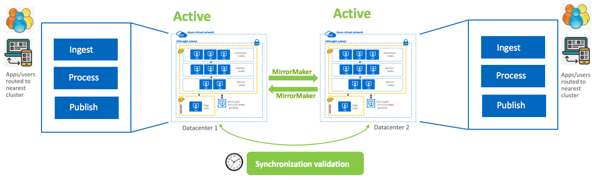
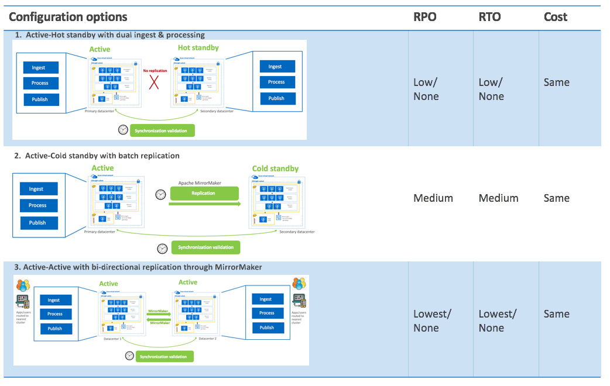

# Apache Kafka Disaster Recovery in Azure HDInsight

## What is Disaster Recovery

Disaster recovery (DR) is focused on recovering from a catastrophic loss of application functionality. For example, if an Azure region hosting your application becomes unavailable, you need a plan for running your application or accessing your data in another region.

Business and technology owners must determine how much functionality is required during a disaster. This level of functionality can take a few forms: completely unavailable, partially available via reduced functionality or delayed processing, or fully available.

Resiliency and high availability strategies are intended for handling temporary failure conditions. Executing this plan involves people, processes, and supporting applications that allow the system to continue functioning. Your plan should include rehearsing failures and testing the recovery of databases to ensure the plan is sound.

## Common disaster scenarios

For more information on disaster recovery architectures, see [Disaster recovery for Azure applications](https://docs.microsoft.com/azure/architecture/resiliency/disaster-recovery-azure-applications).

### Application failure

### Data corruption

### Network outage

### Failure of a dependent service

### Region-wide service disruption

### Azure-wide service disruption

## Data strategies and topologies

### Active - Hot standby with dual ingest and processing

- Applications/integration processes write to Kafka on both clusters
- Both clusters run identical batch jobs and processes to consumer from Kafka
- Standby cluster is offline for reads by applications and end users
- Synchronization tasks need to be run to ensure data is in sync in destination store
- RPO => Low/None | RTO => Low/None | Cost => High

### Active- cold standby with batch replication

- Applications write to Kafka on the active-primary ONLY
- Replication to DR Kafka cluster is incremental, batch, scheduled with Apache MirrorMaker
- Synchronization tasks need to be run to ensure data is in sync in destination store
- RPO => Medium | RTO => Medium | Cost => High

### Active-Active (bi-directional replication) with Apache MirrorMaker

- Applications/integration processes publish to/consume from nearest Kafka
- Both clusters run identical processing
- Synchronization tasks need to be run to ensure data is in sync in destination store
- RPO => Lowest/None | RTO => Lowest/None | Cost => High

### Comparing strategies and topologies

## Setting up replication for Kafka disaster recovery using Apache MirrorMaker

1. Select primary data center (eg East US, West US 2) DC1
1. Create a resource group R1 in DC1
1. Within R1, provision virtual network VNET1
1. Within R1 and using VNET1, provision HDInsight Kafka cluster KF1 (using newly created storage account SA1)
1. Select secondary data center DC2
1. Create a resource group R2 in DC2
1. Within R2, provision virtual network VNET2 with an address range that does not overlap with the address range of VNET1 in DC1
1. Within R2 and using VNET2, provision HDInsight Spark cluster KF2 (using newly created storage account SA1)
1. Peer VNET1 with VNET2 and VNET2 with VNET1
1. Enable both clusters to braodcast IP addresses
1. Enable both clusters to listen on all network interfaces
1. On the secondary cluster:
    1. Create a producer.properties file that lists secondary cluster bootstrap servers with port
    1. Create a consumer.properties file that lists primary cluster's zookeeper servers with port and consumer group
    1. Launch MirrorMaker with the two properties files, topic name and relevant parameters

## Monitoring for disaster recovery

## Automating disaster recovery

## Next steps
