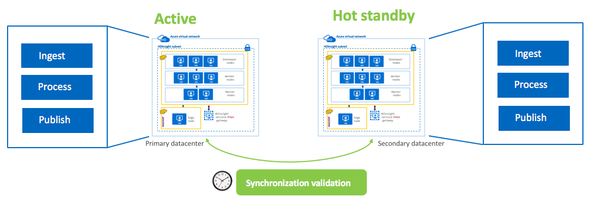
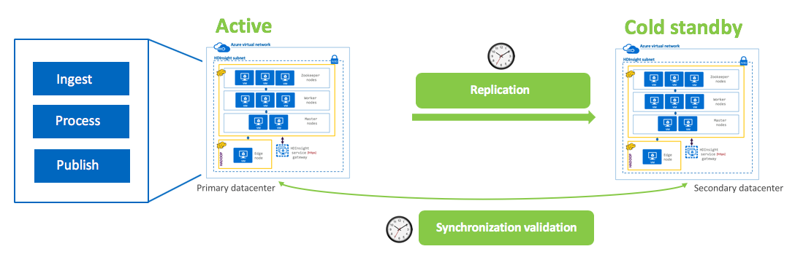
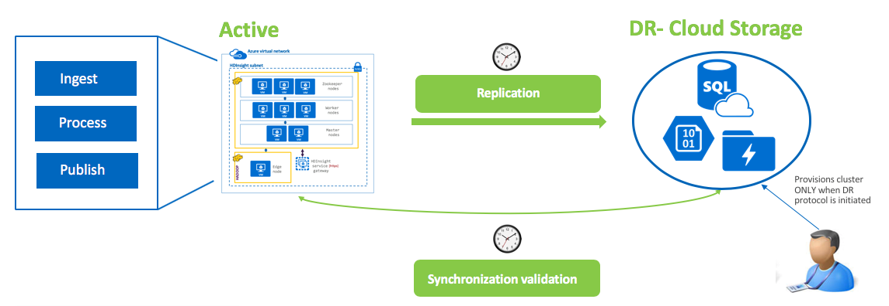
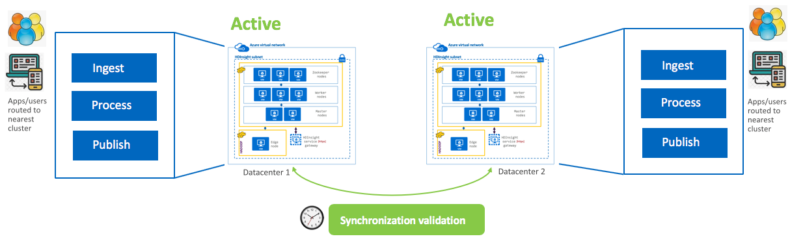
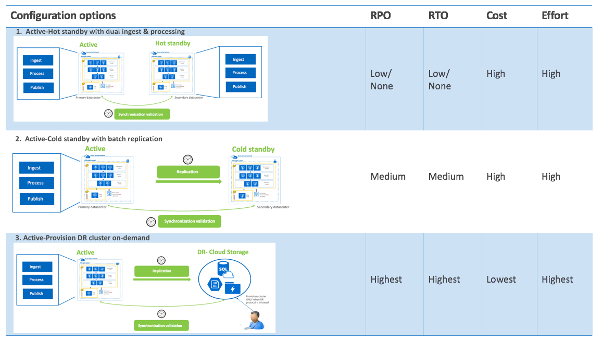
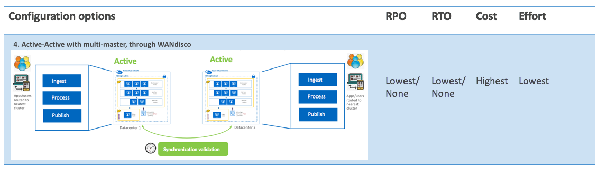

# Apache Spark Disaster Recovery in Azure HDInsight

## What is Disaster Recovery

Disaster recovery (DR) is focused on recovering from a catastrophic loss of application functionality. For example, if an Azure region hosting your application becomes unavailable, you need a plan for running your application or accessing your data in another region.

Business and technology owners must determine how much functionality is required during a disaster. This level of functionality can take a few forms: completely unavailable, partially available via reduced functionality or delayed processing, or fully available.

Resiliency and high availability strategies are intended for handling temporary failure conditions. Executing this plan involves people, processes, and supporting applications that allow the system to continue functioning. Your plan should include rehearsing failures and testing the recovery of databases to ensure the plan is sound.

## Common disaster scenarios

For more information on disaster recovery architectures, see [Disaster recovery for Azure applications](https://docs.microsoft.com/azure/architecture/resiliency/disaster-recovery-azure-applications).

### Application failure

### Data corruption

### Network outage

### Failure of a dependent service

### Region-wide service disruption

### Azure-wide service disruption

## Data strategies and topologies

### Active - Hot standby with dual ingest and processing

  
- Applications/integration processes write to both clusters
- Both clusters run identical batch jobs
- Standby cluster is offline for reads by applications and end users
- Synchronization tasks need to be run to ensure clusters are in sync
- RPO => Low/None | RTO => Low/None | Cost => High

### Active - Cold standby with scheduled/batch replication to DR

  
- Applications write to active-primary ONLY
- Replication to DR cluster is incremental, batch, scheduled
- Synchronization tasks need to be run to ensure clusters are in sync
- Only curated data is copied over, no processing jobs are run
- Its is not uncommon to have a storage dense, compute light DR cluster for cost optimization
- RPO => Medium | RTO => Medium | Cost => High
-->

### Active - DR cluster provisioned on-demand/as needed

  
- Applications write to active-primary cluster, no DR cluster provisioned
- Replication utilities synchronize data and metastore to cloud storage in DR datacenter
- Administrator provisions cluster on-demand in DR datacenter
- Synchronization tasks need to be run to ensure clusters are in sync
 - RPO => Highest | RTO => Highest | Cost => Lowest

### Active - Active with multi-master made possible by WANdisco

  
- Applications/integration processes write to/read from nearest cluster clusters
- Both clusters run identical batch jobs
- Synchronization tasks need to be run to ensure clusters are in sync
- WANdisco fusion supports automated metadata replication (sync) and data replication (async), scheduling, monitoring, alerting, bandwidth throttling and more
 - RPO => Lowest/None | RTO => Lowest/None | Cost => Highest | Effort => Lowest

### Comparing the options

  

## Setting up replication for disaster recovery

1. Select primary data center (eg East US, West US 2) DC1
1. Create a resource group R1 in DC1
1. Within R1, provision virtual network VNET1
1. Within R1 and using VNET1, provision HDInsight Spark cluster SP1 (using newly created storage account SA1)
1. Select secondary data center DC2
1. Create a resource group R2 in DC2
1. Within R2, provision virtual network VNET2 with an address range that does not overlap with the address range of VNET1 in DC1
1. Within R2 and using VNET2, provision HDInsight Spark cluster SP2 (using newly created storage account SA1)
1. Peer VNET1 with VNET2 and VNET2 with VNET1
1. Create storage account SA3
1. Create containers in SA3: staging and raw
1. Attach SA3 to SP1 (using script action)
1. Create storage account SA4
1. Create containers in SA4: staging and raw
1. Attach SA4 to SP2 (using script action)
1. Test access from SP1 to SA1
1. Create storage account SA2
1. Attach SA2 to SP2
1. Create containers in SA2
1. Test access from SP2 to SA2
1. Execute distcp to replicate data from SA3 to SA4
1. Validate replication

## Monitoring for disaster recovery

## Automating disaster recovery

## Next steps